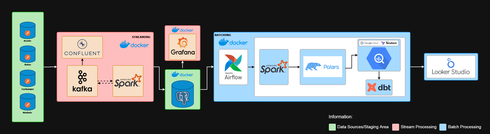

# Hybrid Data Pipeline for Stream and Batch Processing of Cryptocurrency Market Data

Welcome to my last project on the bootcamp platform organized by Dibimbing

## About The Project

<div style="text-align: center;">
  
</div>

The project is about Cryptocurrency has become one of the fastest growing financial sectors, with thousands of digital assets traded on exchanges around the world. Information such as price, volume, and market activity is often scattered and not standardized, making it difficult to conduct comprehensive analysis. The project aims to develop a CoinCap API-based solution capable of providing real-time data on the price and market activity of over 1,000 cryptocurrencies.

The dataset used is from the CoinCap API 2.0 Platform which provides real-time data on prices, market capitalization, volume, and other information about cryptocurrencies. Before performing the extraction process, it is important to understand the structure and scope of the data provided by the API. The CoinCap API has various endpoints to access specific data:

- `Assets`      : Provides data on available cryptocurrencies, including current prices, price changes, market capitalization, and volume.
- `Rates`       : Provides cryptocurrency exchange rates to fiat currencies or other cryptocurrencies.
- `Exchanges`   : Information about cryptocurrency trading platforms.
- `Markets`     : Details of the markets where cryptocurrencies are traded.

<div style="text-align: center;">
  
</div>

# A Project Includes The Following Files:

- docker compose file used to configure the schedule project such as using airflow and Postgresql as database in locally.
- Dockerfile for text containing the commands needed to create an image for executing ingestions.
- Python scripts for executing ingestions, creating dags, ETL processes, and using Apache such as: Kafka, Spark and Airflow.
- Sql script for executing create database, read data from database and create data modeling such as: Postgresql and DBT.
- Grafana for monitoring visualization dashboard on real time.
- Looker studio data for create reporting to visualization dashboard per batch.
- Terraform for used provision and manage resources, such as virtual machines or cloud instances, networking, storage, and other components in your cloud environment.
- Google Cloud Platform (GCP) is a cloud computing service product owned by Google. in the cloud it can minimize complexity and offer solutions for your storage, analytics, big data, machine learning and application development needs.

# Technologies

- Cloud                         : Google Cloud Platform (GCP)
- Infrastructure as code (IaC)  : Terraform
- Container                     : Docker
- Workflow orchestration        : Apache Airflow
- RDBMS                         : PostgreSQL
- Data Modeling                 : DBT
- Data Warehouse                : BigQuery
- Stream processing             : Apache Kafka and Apache Spark
- Batch processing              : Apache Spark and Polars
- Programming                   : Python and SQL
- Visualization Dashboard       : Grafana and Looker Studio Data 

# Workflow



# Run Project

1. Clone This Repo.
2. Run docker build :
- `make docker-build`
3. Run for stream processing :
- `make kafka`
- `make postgres`
- `make spark`
- `make spark-produce-crypto`
- `make spark-consume-assets`
- `make spark-consume-rates`
- `make spark-consume-exchanges`
- `make spark-consume-markets`
4. Run for create a dataset on BigQuery :
- `cd terraform`
- `terraform init`
- `terraform apply`
* if you want to delete the dataset, run this `terraform destroy`
5. Run for batch processing :
- `make postgres`
- `make spark`
- `make airflow`

---
```
## docker-build		- Build Docker Images (amd64) including its inter-container network."
## spark				  - Run a Spark cluster, rebuild the postgres container, then create the destination tables "
## kafka				  - Spinup kafka cluster"
## airflow				- Build to orchestrator"
## postgres				- Run database of relationship"
## terraform      - Automate several services that are needed, such as: BigQuery"
## grafana				- Monitoring real-time data"
```
