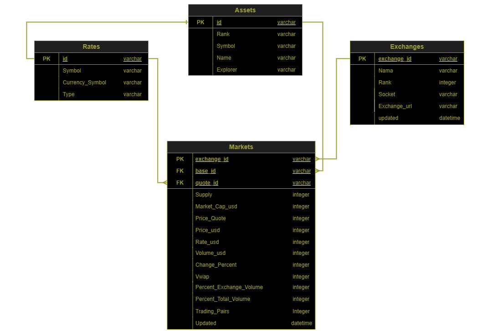

# Hybrid Data Pipeline for Stream and Batch Processing of Cryptocurrency Market Data

**Welcome to my last project on the bootcamp organized by Dibimbing**

## About The Project

<div style="text-align: center;">
  
</div>

The project is about Cryptocurrency has become one of the fastest growing financial sectors, with thousands of digital assets traded on exchanges around the world. Information such as price, volume, and market activity is often scattered and not standardized, making it difficult to conduct comprehensive analysis. The project aims to develop a CoinCap API-based solution capable of providing real-time data on the price and market activity of over 1,000 cryptocurrencies.

The dataset used is from the CoinCap API 2.0 Platform which provides real-time data on prices, market capitalization, volume, and other information about cryptocurrencies. Before performing the extraction process, it is important to understand the structure and scope of the data provided by the API. The CoinCap API has various endpoints to access specific data:

| Data         | Description                                                                                                              |
|--------------|--------------------------------------------------------------------------------------------------------------------------|
| `Assets`     | Provides data on available cryptocurrencies, including current prices, price changes, market capitalization, and volume. |
| `Rates`      | Provides cryptocurrency exchange rates to fiat currencies or other cryptocurrencies.                                     |
| `Exchanges`  | Information about cryptocurrency trading platforms.                                                                      |
| `Markets`    | Details of the markets where cryptocurrencies are traded.                                                                |

# ERD (Entity Relationship Diagram)

<div style="text-align: center;">
  
</div>

# Data Structure

1. Assets:

| Column       | Description                                                                                                                    |
|--------------|--------------------------------------------------------------------------------------------------------------------------------|
| **id**       | Unique identifier for the asset.                                                                                               |
| **name**     | Proper name for the asset.                                                                                                     |
| **rank**     | Rank in ascending order; this number is directly associated with the market cap, where the highest market cap receives rank 1. |
| **symbol**   | Most common symbol used to identify this asset on an exchange.                                                                 |
| **explorer** | Website associated with the cryptocurrency asset.                                                                              |

2. Rates :

| Column              | Description                                            |
|---------------------|--------------------------------------------------------|
| **id**              | Unique identifier for asset or fiat.                   |
| **symbol**          | Most common symbol used to identify asset or fiat.     |
| **currencySymbol**  | Currency symbol used to identify asset or fiat         |
| **type**            | Type of currency - fiat or crypto                      |

3. Exchanges:

| Column            | Description                                                                                                                                     |
|-------------------|-------------------------------------------------------------------------------------------------------------------------------------------------|
| **exchange_id**   | Unique identifier for the exchange.                                                                                                             |
| **name**          | Proper name of the exchange.                                                                                                                    |
| **rank**          | Rank in ascending order; this number is directly associated with the total exchange volume, where the highest volume exchange receives rank 1.  |
| **socket**        | true/false; true = trade socket available, false = trade socket unavailable.                                                                    |
| **exchange_url**  | Website associated with the exchange.                                                                                                           |
| **updated**       | UNIX timestamp (milliseconds) since information was received from this exchange.                                                                |

4. Markets:

| Column                      | Description                                                                                                                 |
|-----------------------------|-----------------------------------------------------------------------------------------------------------------------------|
| **exchange_id**             | Unique identifier for the exchange.                                                                                         |
| **base_id**                 | Unique identifier for this asset; base is the asset purchased.                                                              |
| **quote_id**                | Unique identifier for this asset; quote is the asset used to purchase the base.                                             |
| **supply**                  | Available supply for trading.                                                                                               |
| **market_cap_usd**          | Supply x price.                                                                                                             |
| **price_quote**             | The amount of quote asset traded for one unit of base asset.                                                                |
| **price_usd**               | Volume-weighted price based on real-time market data, translated to USD.                                                    |
| **rate_usd**                | Rate conversion to USD.                                                                                                     |
| **volume_usd**              | Volume transacted on this market in the last 24 hours.                                                                      |
| **change_percent**          | The direction and value change in the last 24 hours.                                                                        |
| **vwap**                    | Volume Weighted Average Price in the last 24 hours.                                                                         |
| **percent_exchange_volume** | The amount of daily volume a single market transacts in relation to the total daily volume of all markets on the exchange.  |
| **percent_total_volume**    | The amount of daily volume a single exchange transacts in relation to the total daily volume of all exchanges.              |
| **trading_pairs**           | Number of trading pairs (or markets) offered by the exchange.                                                               |
| **updated**                 | UNIX timestamp (milliseconds) since information was received from this particular market.                                   |

# A Project Includes The Following Files:

| Project Files                    | Description                                                                                                                      |
|----------------------------------|----------------------------------------------------------------------------------------------------------------------------------|
| **docker compose**               | File used to configure the schedule project, such as using Airflow and PostgreSQL as a database locally.                         |
| **Dockerfile**                   | Text containing the commands needed to create an image for executing ingestions.                                                 |
| **Python**                       | Scripts for executing ingestions, creating DAGs, ETL processes, and using Apache tools like Kafka, Spark, and Airflow.           |
| **SQL**                          | Scripts for creating databases, reading data from databases, and data modeling with tools like PostgreSQL and DBT.               |
| **Grafana**                      | Used for monitoring visualization dashboards in real time.                                                                       |
| **Looker Studio Data**           | Used for creating reporting dashboards per batch.                                                                                |
| **Terraform**                    | Used to provision and manage resources like virtual machines, cloud instances, networking, and storage in the cloud environment. |
| **Google Cloud Platform (GCP)**  | A cloud computing service by Google to simplify storage, analytics, big data, machine learning, and application development.     |


# Technologies

| Technologies                      | Tools/Technologies                        |
|-----------------------------------|-------------------------------------------|
| **Cloud**                         | Google Cloud Platform (GCP)               |
| **Infrastructure as Code (IaC)**  | Terraform                                 |
| **Container**                     | Docker                                    |
| **Workflow orchestration**        | Apache Airflow                            |
| **RDBMS**                         | PostgreSQL                                |
| **Data Modeling**                 | DBT                                       |
| **Data Warehouse**                | BigQuery                                  |
| **Stream processing**             | Apache Kafka and Apache Spark             |
| **Batch processing**              | Apache Spark and Polars                   |
| **Programming**                   | Python and SQL                            |
| **Visualization Dashboard**       | Grafana and Looker Studio Data            |

# Workflow


# Run Project

1. **Clone This Repo** 
2. **Run docker build** :
- `make docker-build`
3. **Run for stream processing** :
- `make kafka`
- `make postgres`
- `make spark`
- `make spark-produce-crypto` 
- `make spark-consume-assets`
- `make spark-consume-rates`
- `make spark-consume-exchanges`
- `make spark-consume-markets`
4. **Run for create a dataset on BigQuery** :
- Create a folder and name it credentials, then download the service account file on GCP and put it in the credentials folder then use it as the variable "credentials" for the variables.tf file in the terraform folder.
- `cd terraform`
- `terraform init`
- `terraform apply`
* if you want to delete the dataset, run this `terraform destroy`
5. **Run for batch processing** :
- `make postgres`
- `make spark`
- `make airflow`
- Create a folder and name it credentials in the dbt folder, then download the service account file on GCP and put it in the credentials folder then rename it to keys.json
- run DAGs in Airflow
6. **Run for visualization dashboard**
- `make grafana` (username: admin & password: admin)
- Open this url : https://lookerstudio.google.com/ and connect to data sources BigQuery then create a report for analyst


| Command        | Description                                                                              |
|----------------|------------------------------------------------------------------------------------------|
| `docker-build` | Build Docker Images (amd64) including its inter-container network.                       |
| `spark`        | Run a Spark cluster, rebuild the postgres container, then create the destination tables. |
| `kafka`        | Spin up a Kafka cluster.                                                                 |
| `airflow`      | Build the orchestrator.                                                                  |
| `postgres`     | Run the database of relationships.                                                       |
| `terraform`    | Automate several services that are needed, such as BigQuery.                             |
| `grafana`      | Monitor real-time data.                                                                  |


# Documentation

- **Topics on Confluent**
<div style="text-align: center;">
    
</div>

- **Spark for stream and batch processing**
<div style="text-align: center;">
    
</div>

- **DAGs on Airflow**
<div style="text-align: center;">
    
</div>

- **Data Warehouse on BigQuery**
<div style="text-align: center;">
    

- **Dashboard on Grafana**
<div style="text-align: center;">
    
</div>

- **Dashboard on Looker Studio Data and url to Dashboard**
<div style="text-align: center;">
    
</div>

---
```
https://lookerstudio.google.com/reporting/210d6330-cdad-4e44-a4e3-1708390aa63c
```